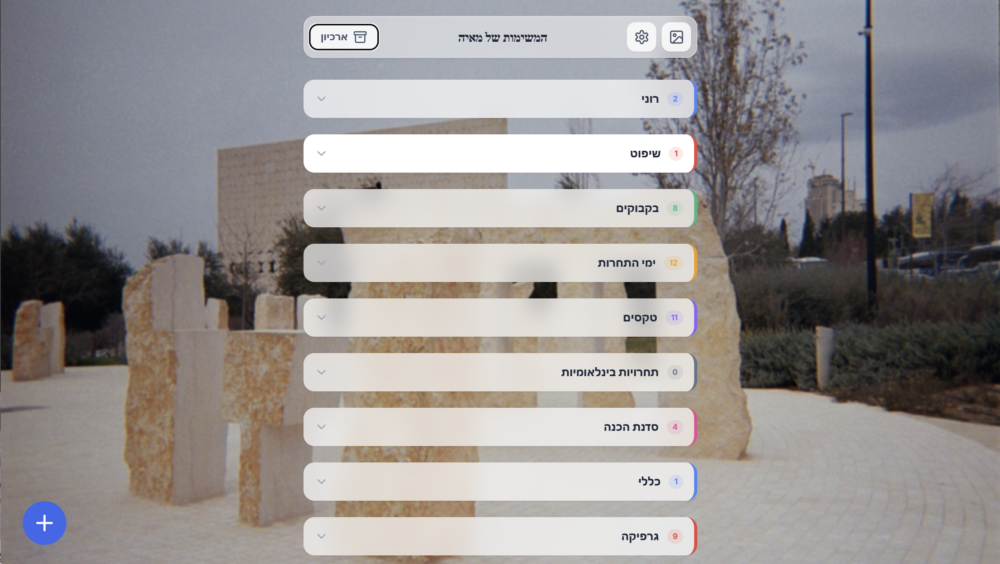

# המשימות של מאיה 📓

**המשימות של מאיה** היא אפליקציה חכמה, מעוצבת ואינטואיטיבית לניהול משימות אישיות. האפליקציה נבנתה בדגש על חווית משתמש נקייה (Minimalist UX) ותמיכה מלאה בעברית (RTL).

## ✨ תכונות עיקריות

- **ניהול קטגוריות חכם**: ארגון משימות לפי קטגוריות מותאמות אישית עם אייקונים וצבעים ייחודיים.
- **ממשק מודרני**: עיצוב נקי עם אפקטים של טשטוש (Glassmorphism) ומעברים חלקים.
- **התאמה אישית**: אפשרות לשינוי רקע האפליקציה לכל תמונה מהרשת.
- **ארכיון משימות**: שמירה על סדר באמצעות העברת משימות שהושלמו לארכיון.
- **סנכרון בזמן אמת**: עבודה מול Firebase לשמירה וסנכרון הנתונים מכל מכשיר.

## 🛠 טכנולוגיות

- **React 19** & **TypeScript**
- **Tailwind CSS** לעיצוב מודרני ומהיר
- **Firebase Firestore** למסד נתונים בזמן אמת
